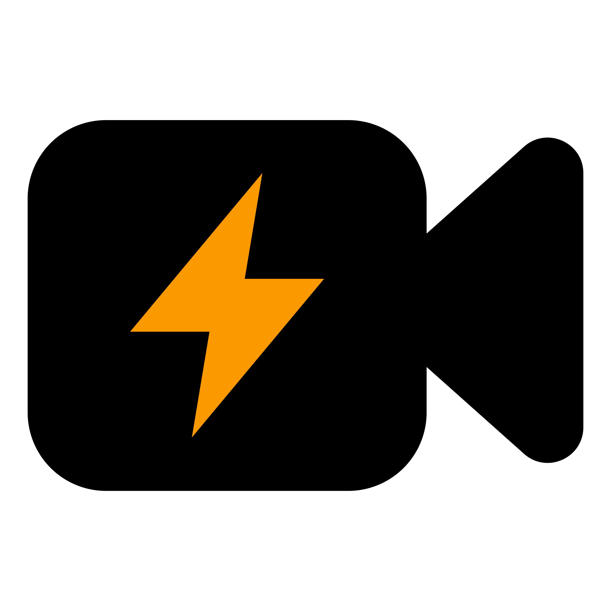

<p align="center"></p>

# VEVE - Very Easy Video Editing

VEVE is an Electron-based video editing application with a React frontend, built using Vite.

## Development Instructions

### Prerequisites

- Node.js v18 or higher
- npm v9 or higher

### Installation

1. Clone the repository
2. Install dependencies:

```bash
npm install
```

### Running in Development Mode

Start the development server:

```bash
npm run dev
```

This will:

- Start the Vite dev server for the React frontend
- Launch the Electron application with hot-reloading

### Building for Production

To create a production build for:

Window:

```bash
npm run dist:window
```

Linux AppImage:

```bash
npm run dist:linux
```

This will:

- Build the React frontend
- Package the Electron application
- Create installers for Windows, macOS and Linux

The built application will be in the `dist` folder.

### Project Structure

```
veve/
├── src/
│   ├── electron/        # Electron main process code
│   └── ui/             # React frontend
│       ├── assets/      # Static assets
│       ├── components/  # React components
│       └── pages/       # Application pages
├── vite.config.js      # Vite configuration
├── electron-builder.json # Electron build config
├── tailwind.config.js  # Tailwind CSS config
└── package.json        # Project dependencies and scripts
```

### Linting and Formatting

The project uses ESLint and Prettier for code quality:

- Run linter:

```bash
npm run lint
```

### Available Scripts

- `dev`: Start development server
- `build`: Create production build
- `lint`: Run ESLint
- `preview`: Run vite preview
- `dist:window`: Build for prod
- `dist:linux`: Build for prod

### Contributing

1. Fork the repository
2. Create a feature branch
3. Commit your changes
4. Push to the branch
5. Create a pull request

Please ensure your code follows the project's linting rules and includes appropriate tests.

```

```
